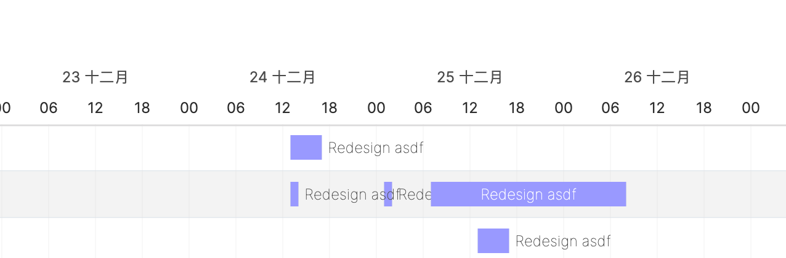

# Next.js with frappe-gantt and gantt-for-react in one row

This project is a demo of how to use frappe-gantt and gantt-for-react to put tasks into one row.

The `row_id` in tasks' data controls the displayed row order for each task, codes are in page.tsx.